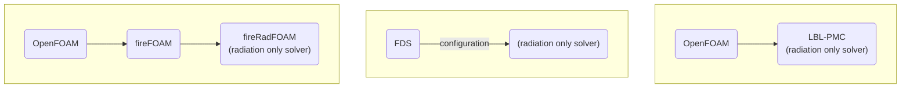
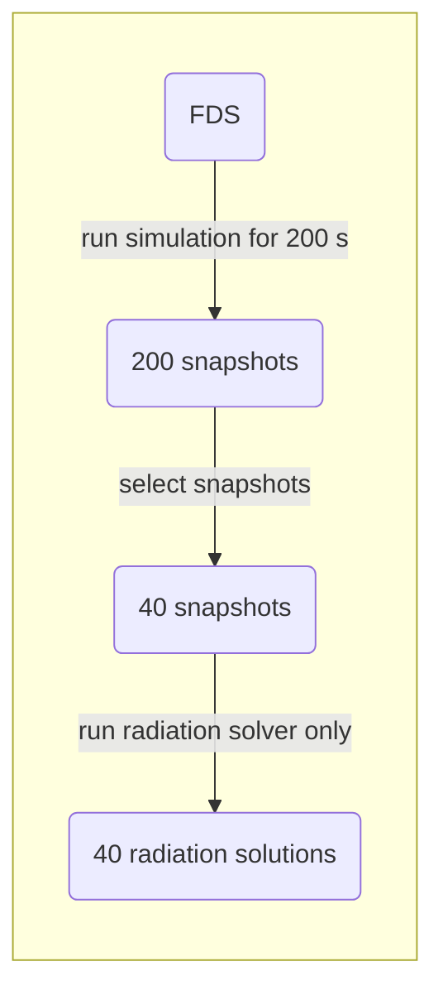

# radi-db

Measurement and Computation of Radiative Heat Transfer Phenomena Database

Welcome to the MaCFP database!

The central objective of the MaCFP working group is to target
fundamental progress in fire science and to advance predictive fire
modeling. The purpose of this database is to host high-quality
experimental and benchmark simulation data for the purpose of validating physics-based fire
models. The working group meets before the IAFSS conference currently
held every three years.

<!-- markdown-toc start - Don't edit this section. Run M-x markdown-toc-refresh-toc -->
**Table of Contents**

- [radi-db](#radi-db)
    - [Introduction](#introduction)
    - [Folder Overview](#folder-overview)
    - [File names](#file-names)
    - [Benchmark Cases](#benchmark-cases)
    - [Scripts, Tools and Templates](#scripts-tools-and-templates)
        - [OpenFOAM](#openfoam)
            - [fireRadFoam ](#fireradfoam)
        - [Python](#python)

## Introduction

<XXXX A bit more infoXXX>
To improve CFD simulations validation with high quality experimental data or "gold standard" simulation data is necessary. The present, flexible data base, that can be extended by community contributions, is designed to serve this need by collecting CFD benchmark cases, where high quality experimental data as well es "gold standard" simulation data are available.

The goal is to provide the data in a form, that is sufficient to reproduce (with proper version of FDS and fireFoam installed) the simulation data. 

The basic structure of a case folder is described in [Folder Overview](#folder-overview), basic filename conventions are described in [File Names](#file-names) and the basic field names are described in the section [Naming Conventions for Fields](#naming-conventions-for-fields).

The basic structure and filename conventions provide a template, from which special cases may differ, with respect to their status in comprehensiveness, which evolves over time.

Section [Benchmark Cases](#benchmark-cases) shows a list of available cases.

Since this working group is focused on radiation modeling, the simulations are restricted on the radiation part The procedure is described in the [Methodology](#methodology) section.

The folder [Scripts, Tools and Templates](#scripts-tools-and-templates) contains files, that do not fit in the previous structure.

## Folder Overview

The General structure looks like:
- Simulation Case
  - 00_Documentation
    - General Information about the case
  - 01_Experimental_Data
    - Reference and description of available experimental data
  - 02_Simulation_Base
    - This folder includes the initial "base" simulation setup of FDS and/or OpenFOAM  (FM Burner: FDS, NIST Pool Fire: OpenFOAM).
  - 03_Simulation_LBL_PMC
    - This folder includes the benchmark data (downloadable via the provided scripts) based on the PMC-LBL solver.
  - 04_Computational_Results
    - As for the gas phase subgroup, there the computational results of the participants are stored.
    - This folder includes also two template folders
      - One folder provides a template for the calculation with mapped
        data for FDS and OpenFOAM; these data can be used for
        benchmarking against the LBL-PMC data. The subfolders with the
        suffix `_mapped_Snapshots` provide the scripts to download, run
        and post-process radiation settings.
      - The second folder provides guidance for post-processing the results of the new calculations with FDS and OpenFOAM.
  - 05_Utilities
    - This folder might include additional scripts for handling certain cases individually.

## File Names
In case file names and folders have a number prefix, possible actions (reading, execution of scripts) should be performed in the order of the number prefix.

E.g. the number prefixes in the file structure:
- 00_Documentation
- 01_Experimental_Data
- 02_Simulation_Base
- 03_Simulation_LBL_PMC
- 04_Computational_Results
mean, that you should first read the documentation "00", then go to experimental data "01" and so on.

In case subfolders contain scripts, they have to be executed in the order of the prefix, e.g. in `02_Simulation_Base/FDS_mapped_Snapshots` you find:
- 00_download_files.sh
- 02_adjust_copy_FDS_template.py
- 03_run_FDS.py
which means: first execute "00_download_files.sh" and so on. 

The actual details are described within each folder.

## Naming Conventions for Fields

### Field Names

| Field           | Type                     | Field name for OPF | Field name for FDS |
|-----------------|--------------------------|--------------------|--------------------|
| Nitrogen        | Mass fraction            | N2                 |                    |
| Oxygen          | Mass fraction            | O2                 |                    |
| Carbon dioxide  | Mass fraction            | CO2                |                    |
| Carbon monoxide | Mass fraction            | CO                 |                    |
| Ethylene        | Mass fraction            | C2H4               |                    |
| Water Vapor     | Mass fraction            | H2O                |                    |
| Soot            | Mass fraction            | Soot               |                    |
| Nitrogen        | Volume fraction          | N2_vol             |                    |
| Oxygen          | Volume fraction          | O2_vol             |                    |
| Carbon dioxide  | Volume fraction          | CO2_vol            |                    |
| Carbon monoxide | Volume fraction          | CO_vol             |                    |
| Ethylene        | Volume fraction          | C2H4_vol           |                    |
| Water Vapor     | Volume fraction          | H2O_vol            |                    |
| Soot            | Volume fraction          | Soot_vol           |                    |
| Soot            | Aerosol Volume fraction  | fvSoot             |                    |
| Density         | (warning: dimensionless) | rho                |                    |
| Temperature     | (Kelvin)                 |                    |                    |

Comment: Pressure is not available in this list as it is not mapped and as it has minor impact
on the final results (this was checked for time step 15).

## Benchmark Cases

Detailed description about the benchmark cases are provided in the READMEs of the corresponding subfolders.

- NIST Pool Fires [NIST Pool Folder](/NIST_Pool_Fires/README.md)

- FM Burner: [FM Burner Folder](/FM_Burner/README.md)

The folder structure of both test cases are prepared in a similar manner, but some scripts or simulation data are different (e.g. for the NIST pool fire there is up to now no FDS mapping).

## Methodology

- focus on radiation, therefore not hole system of field equations is solved, but a fds simulation is run for 200s () with time step size $\Delta t=$
- In case of FDS only 
- Diagram OF, Diagram FDS, Diagram LBL
### Solver Terminology

The whole procedure looks like: 

### Snapshot Generation and Radiation Benchmark

## Scripts, Tools and Templates

### OpenFOAM
#### fireRadFoam 

`fireRadFoam_MaCFP` is an adjusted fireFoam solver, which is based on
standard `fireFoam` (ESI v2212) and runs only the radiation part.

The adjusted solver is located in [Utilities OpenFOAM folder](/Utilities/OpenFOAM/fireRADFoam_MaCFP) .

### Python
The plotting is done with the same approach and `macfp.py` script like for the gas phase group.

Further scripts are provided within the test cases.
